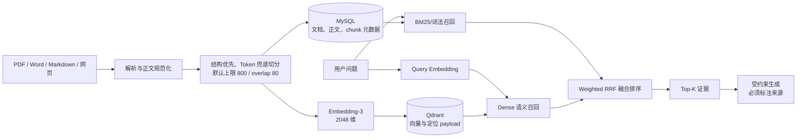

# Hermes 智维：企业知识与 Agent 架构说明

本文既是运行手册，也是面试时可直接讲述的设计说明。当前产品定位是“企业智能工作台”：把企业知识、结构化数据、标准流程和 Agent 执行统一到一个可持久化、可审计的 Python 平台中。

## 1. 产品定位

项目展示名为 **Hermes 智维 · 企业智能工作台**。

它不是一个单纯聊天机器人，而是面向客服、售后、运营、数据分析等企业角色的统一工作台：

- 企业知识库：文档治理、混合检索、引用回答和权限扩展点。
- Agent 执行：自动路由、ReAct、Plan-Solve 和固定 Workflow。
- 企业数据：上传数据集、自然语言查询和结果可视化。
- 可交付输出：聊天、文档、网页、PPT 和表格。
- 可运维底座：MySQL 持久化、Qdrant 向量索引、健康探针、运行日志和自动化测评。

## 2. 企业混合检索架构



### 为什么不能只用 BM25

BM25 擅长型号、错误码、产品名等精确词，例如 `E17`、`X2 Pro`；但用户常说“机器热了以后自己停了”，资料里写的却是“E23 研磨电机过热”。两边没有足够的字面重合，纯词法召回容易漏掉。Embedding 将问题和文档映射到语义向量空间，可以召回表达不同但含义相近的内容。

反过来，纯向量检索对错误码、数字、缩写和精确条款不一定稳定，因此系统并行执行两路召回，再用加权 Reciprocal Rank Fusion 融合名次：

`fused_score(d) = 0.35 / (60 + lexical_rank) + 0.65 / (60 + dense_rank)`

RRF 不直接比较 BM25 分数和余弦相似度，避免两种分数尺度不同导致一方“压死”另一方。

### 数据一致性设计

- MySQL 是事实源，保存知识库、文档、规范化正文、chunk、状态和时间戳。
- Qdrant 是可重建索引，payload 保存 `kb_id`、`document_id`、`chunk_index`、标题、章节路径、页码和内容哈希。
- 文档只有在解析、Embedding 和向量写入均成功后才标记为 `READY`；失败会标记为 `FAILED` 并保存错误原因。
- 删除文档或知识库时同时删除 MySQL 记录、原始文件和 Qdrant points。
- `scripts/seed_enterprise_demo_kb.py --reindex` 可从 MySQL 的规范化正文重新切分，并重建全部向量索引。

### 层级切分实现

当前正式入库链路已经不再使用字符滑窗。实现位于 `hermes_officer/application/document_chunker.py`，分成四个确定性阶段：

1. **解析 Block**：维护 Markdown 标题栈，把正文识别为 paragraph、list_item、table、faq、code、warning，并继承 `section_path` 和 PDF page marker。
2. **递归切分超大 Block**：只对超过 `max_tokens` 的 Block 继续向下切，分隔符优先级是空行、换行、句号/问号/叹号、分号、冒号、逗号、空白，最后才按 Token 预算硬切。
3. **从左到右合并小 Block**：默认 `min_tokens=max_tokens×35%`、`target_tokens=max_tokens×70%`、`max_tokens=知识库 chunk_size`。普通段落只在同一章节合并；列表只在同一列表组内合并；warning 优先附着前文；FAQ、表格和代码采用隔离策略。
4. **添加 overlap**：只从同章节的上一 chunk 尾部复制，预算默认 80 Token；加入前会计算当前 chunk 剩余空间，因此最终 `token_count` 不会突破硬上限。

特殊结构不是一刀切：长 FAQ 会把问题重复到每个答案子块；长表格会把表头重复到每个表格子块；标题不单独生成碎片，而是作为 `章节：一级 > 二级` 前缀写入每个 chunk。最终 MySQL 中每个 chunk 的结构如下：

```json
{
  "document_id": "xxx",
  "chunk_index": 7,
  "section_path": ["故障诊断", "E23 研磨电机过热"],
  "page_start": 12,
  "page_end": 13,
  "block_types": ["paragraph", "warning"],
  "token_count": 536,
  "overlap_tokens": 78,
  "text": "...",
  "content_hash": "sha256..."
}
```

PDF 提取时插入页码 marker；Word 提取时保留 Heading 样式、列表和表格；Markdown、网页、CSV、XLSX 会继续转成 Markdown 风格规范化文本。检索结果会把章节路径和页码带入来源标签，例如：`《故障诊断手册》 → 故障诊断 → E23，第 12–13 页`。

Token 计数目前使用 provider-neutral 的确定性估算：中文字符和标点按 1 Token，英文/数字连续串按约 4 字符 1 Token。原因是当前 Embedding 服务没有暴露官方 tokenizer。它比字符数更接近模型输入预算，并且保证本地可复现；若供应商提供 tokenizer，只需替换 `ApproximateTokenCounter`，Block 解析、递归和合并逻辑无需改动。

### 召回拒答

向量库永远能找出“最像”的内容，但“最像”不代表相关。因此当前 Embedding 模型使用 `0.38` 相似度阈值，并用越界问题做校准。没有通过词法覆盖率或向量阈值的结果不会进入生成阶段，避免对春节放假、食堂菜单等知识库外问题强行回答。生产环境应按本企业语料重新校准，而不是照搬该数值。

## 3. Agent 执行策略和输出方式

策略和输出方式都允许用户选择，但默认策略是“自动选择”。这是企业产品中的分层设计：普通用户不需要理解 Agent 内部机制，高级用户或管理员可以固定策略以便复现和审计。

| 策略 | 适用任务 | 运行方式 |
|---|---|---|
| 自动选择 | 默认选项 | 短问题走 ReAct；分析、调研、报告、架构等复杂任务走 Plan-Solve |
| 快速执行（ReAct） | 单目标、少量工具调用 | 模型在思考、调用工具、读取观察结果之间循环，最多 8 轮 |
| 复杂任务（Plan-Solve） | 调研、方案、跨工具分析 | 先生成最多 6 步计划，每步使用 ReAct 执行，最后统一综合 |
| 固定流程（Workflow） | 审批、日报、标准化 SOP | 按管理员配置的节点顺序执行，参数可用 `{{query}}` 注入用户输入 |

输出方式控制最终交付物：

- `聊天`：直接流式回答。
- `文档 / 网页 / PPT`：Agent 被要求在最后调用报告工具，生成可下载文件。
- `表格`：适用于结构化数据结果；当前由数据工具返回结构化内容。

## 4. 防止 Agent 死循环

Agent 本质上是有状态循环，因此不能只相信模型会主动停止。当前有两层确定性保护：

1. **最大轮数**：单次 ReAct 最多 8 轮，超过后返回明确错误事件。
2. **重复调用指纹熔断**：对 `tool_name + canonical_json(arguments)` 计算 SHA-256，取前 16 位作为指纹。参数 JSON 会排序 key，并使用稳定分隔符，所以 `{"a":1,"b":2}` 和 key 顺序不同的等价参数会得到相同指纹。同一指纹最多执行 2 次，第 3 次直接熔断。

例如：

```text
knowledge_search:{"kb_id":"starboat-enterprise-support-v1","query":"E17"}
  -> SHA-256 -> 9f...（前 16 位作为本次运行内的指纹）
```

指纹随工具调用事件返回，工具执行本身还会写入 MySQL 的工具运行记录，便于定位“模型为什么重复调用”和“外部工具是否失败”。

## 5. 已搭建的演示知识库

知识库：`星舟企业设备售后知识库`，固定 ID 为 `starboat-enterprise-support-v1`。

共 7 份资料：治理说明、产品目录、故障诊断、售后 SLA、保修退换、安全合规、客服标准问答。源文件位于 `examples/knowledge/starboat_support/`，初始化脚本会幂等导入：已有 `READY` 文档会跳过，失败文档会删除后重试。

推荐现场演示问题：

- 精确召回：`设备出现 E17 错误码怎么处理？`
- 语义召回：`机器运行一阵子过热并且自己停了，我应该先排查什么？`
- 合规边界：`智能助手可以不经人工直接同意退款吗？`
- 多租户语义：`A公司的员工会不会搜到B公司的内部资料？`
- 越界拒答：`今天员工食堂午餐吃什么？`

## 6. 测评方法与当前数据

数据集位于 `evals/enterprise_kb_retrieval.json`，包含 7 条正样本和 2 条负样本。正样本覆盖精确词、业务改写和跨表述语义；负样本用于校准拒答阈值。

当前实测：

| 指标 | 纯词法 | 混合检索 |
|---|---:|---:|
| Recall@3 | 57.14% | 100.00% |
| MRR@5 | 0.4048 | 0.8571 |
| 负样本拒答准确率 | — | 100.00% |

这组数据用于证明链路和测评方法，不应包装成生产结论；样本量只有 9。生产上线前应从脱敏工单、FAQ、搜索日志中构建至少数百条测试集，按业务类型和难度分层，并进行 Embedding 模型、chunk 策略、权重和阈值的 A/B 离线对比。

## 7. 启动与验证

在 `hermes` 目录执行：

```powershell
# 首次或依赖变化后
uv sync --frozen

# 初始化知识库（本地 Qdrant 模式下应先停止 Web 服务）
.\.venv\Scripts\python.exe scripts\seed_enterprise_demo_kb.py

# 启动
py server.py
```

打开：

- 工作台：`http://127.0.0.1:1601/`
- 企业知识库：`http://127.0.0.1:1601/knowledge`
- API 文档：`http://127.0.0.1:1601/docs`

自动验证：

```powershell
Invoke-RestMethod http://127.0.0.1:1601/health/live
Invoke-RestMethod http://127.0.0.1:1601/health/ready
.\.venv\Scripts\python.exe -m unittest discover -s tests -p "test_*.py"

# 本地 Qdrant 模式下先停止 Web 服务，再执行离线测评
.\.venv\Scripts\python.exe scripts\evaluate_enterprise_kb.py
```

## 8. 配置说明

现有 `TEXT_EMBEDDING_API_KEY` 已验证可用，不需要再申请；`Embedding-3` 实际返回 2048 维，配置已修正。

开发环境当前使用：

```dotenv
KNOWLEDGE_QDRANT_PATH=data/qdrant
TEXT_EMBEDDING_DIMENSION=2048
```

它会把向量持久化到本地目录，是真实 Dense Retrieval，但只适合单进程开发。`server.py` 会在该模式下自动关闭热重载，防止两个进程争用同一个向量目录。生产环境应删除 `KNOWLEDGE_QDRANT_PATH`，改为：

```dotenv
KNOWLEDGE_QDRANT_URL=https://YOUR-CLUSTER.aws.cloud.qdrant.io:6333
QDRANT_API_KEY=your-cluster-api-key
```

原有 Qdrant Cloud 地址在 443、6333 和默认 HTTPS 入口都返回 404，因此当前没有继续使用。部署前需要从 Qdrant Cloud 控制台复制新的 Cluster endpoint 和 Cluster API key。
